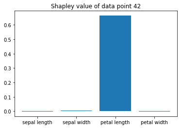
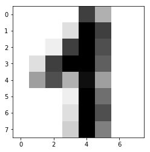
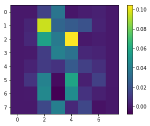

# QII

The `qii_tool` package is an implementation of the QII method proposed in the paper ["Algorithmic Transparency via Quantitative Input Influence: Theory and Experiments with Learning Systems"](https://www.comp.nus.edu.sg/~zick/papers/transparency.oakland16.pdf). The original paper discusses the transparency-privacy tradeoff, whereas this particular package only exploits its transparency aspect to be used as an influence measures for interpretable machine learning.

Install `qii_tool` on your system using:
```python
pip install qii_tool
```
or clone the repository and run:
```python
python setup.py bdist_wheel
python -m pip install dist/qii_tool-0.1.2-py3-none-any.whl
```

Following examples can be found in the [experiments](https://github.com/hovinh/QII/experiments):
- iris dataset


- digits dataset

 


## Extensions:
The package is implemented in such a way that it is easy to extend to user's need. Following are several examples:
- set `evaluted_features` in `QII.compute()` method to evaluate QII value for a selected set of features.
- `QII.compute_unary_qii( si, S)` can be used to compute Unary QII for feature `s_i` with respect to a feature set `S`.
- set `pool` to a specific distribution, e.g. all data points has feature `sepal length` > 4.6 cm, in `QII.compute()`

## Credit:
- The code is adapted from Shayak's version.
- Contact hovinh39@gmail.com  